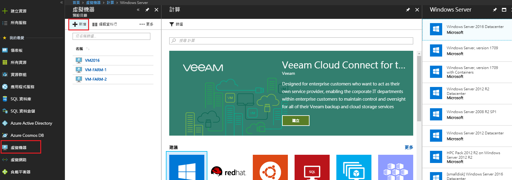
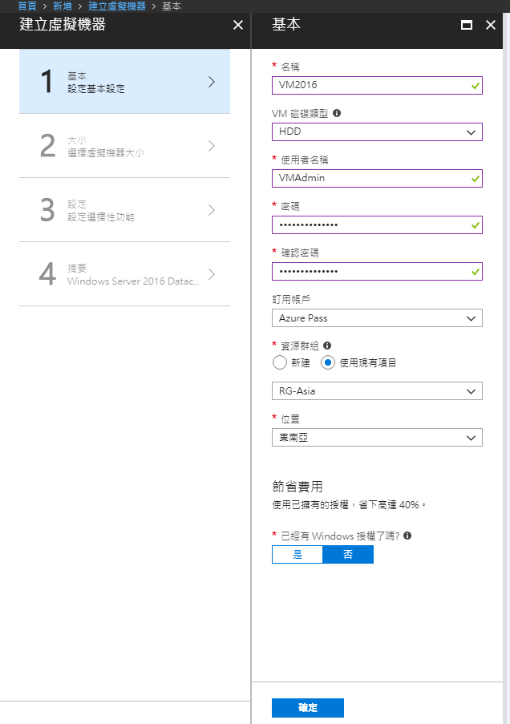
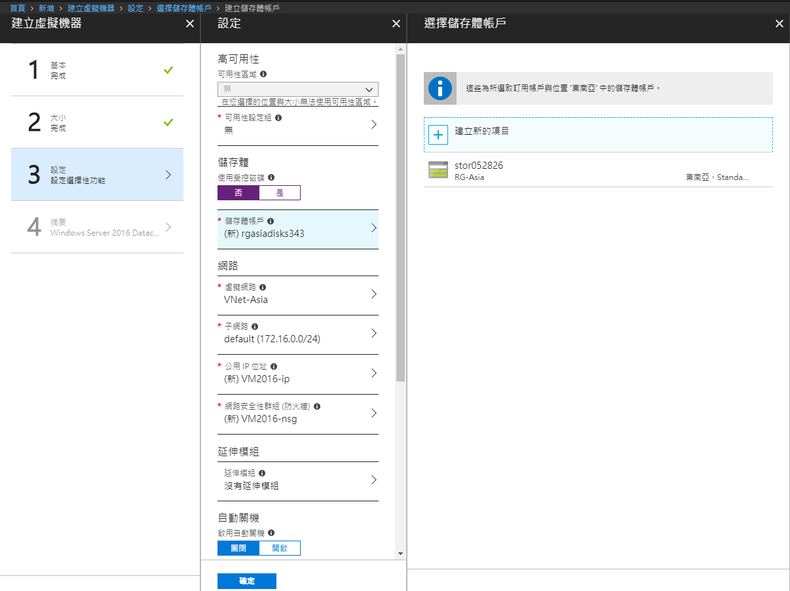
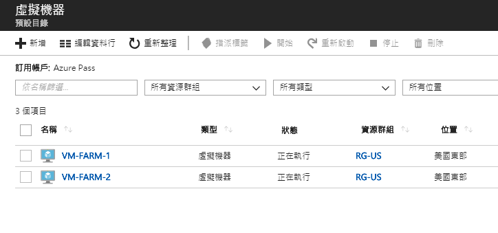
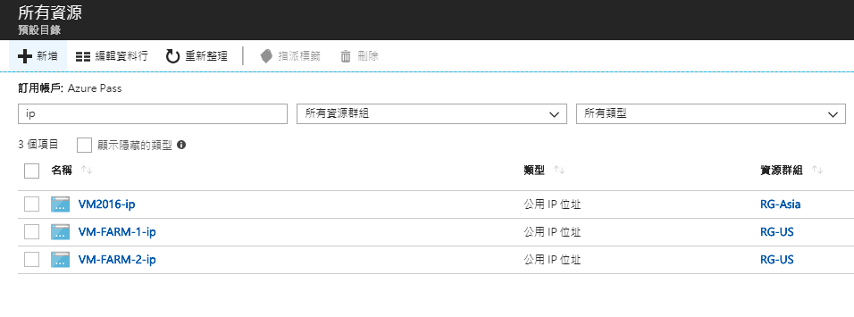
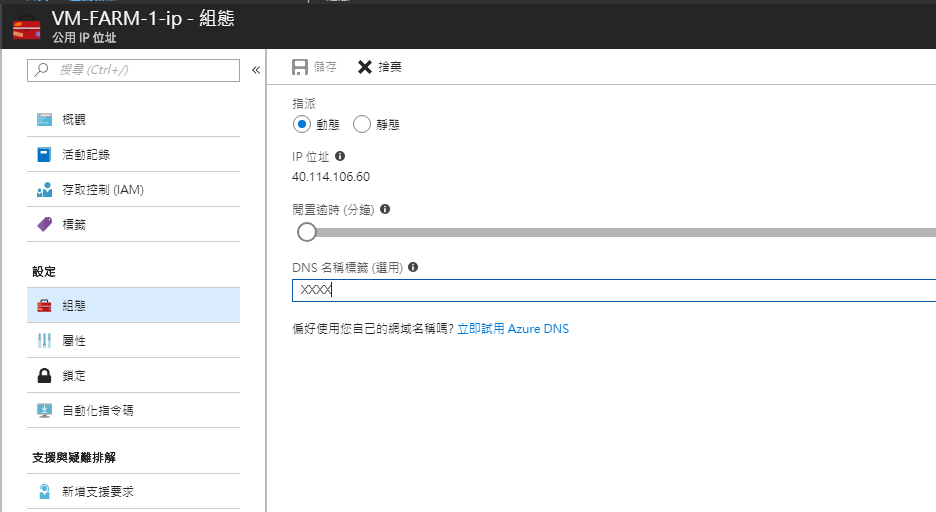
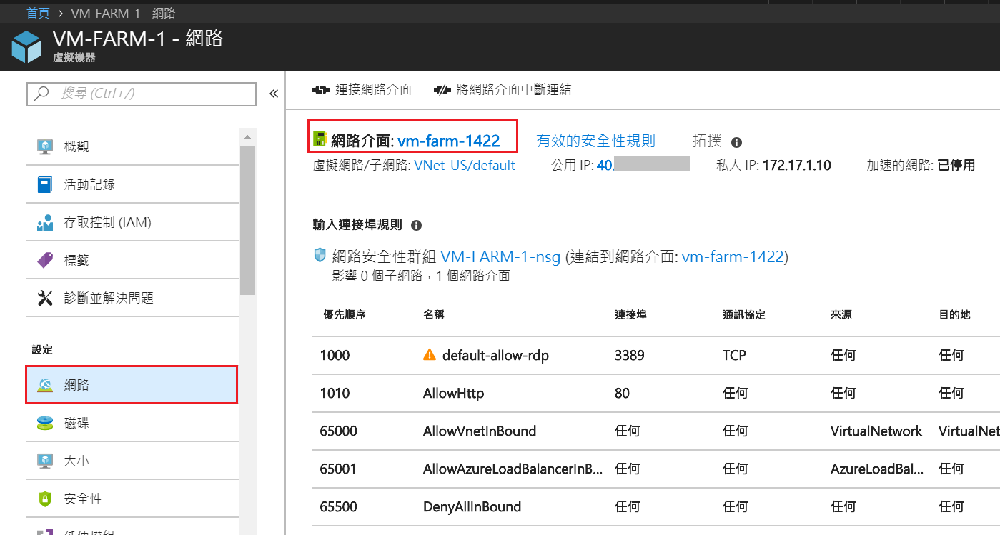
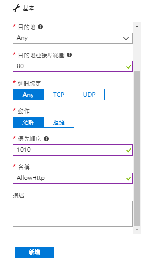

# Virtual Machine

## 建立虛擬機器

至`虛擬機器`，點選`新增`。
然後選擇要建立的作業系統或Image。

設定基本資訊：

Sizing

> 可參考Microsoft document: [Azure 中 Windows 虛擬機器的大小](https://docs.microsoft.com/zh-tw/azure/virtual-machines/windows/sizes)

設定高可用性及設定Storage Account/Virtual Network等其他選項，注意依據Sizing的規格，可能會出現不同的選項(例如HDD/SSD)。
因目前我們尚未設定`可用性設定組`(Availability Set)，所以先忽略高可用性選項。
至於`可受控磁碟`，可選擇`是`讓Azure自行建立新的儲存體帳戶和磁碟，或選擇`否`使用我們先前已建立的儲存體帳戶。

最後一步，確認後按下`建立`。

結果：

## VM對應的資源

建立VM後，如果到`所有資源`查看，若完全使用預設選項，則可以看到Azure已經幫我們加入對應的：

* 網路介面 (Network interface)
* 公用IP位址 (Public IP address)
* 網路安全性群組 (Network security group)
* 儲存體帳戶 (Storage Account)
* 磁碟 (Disk)

## 設定公用IP位址

可由`所有資源`選擇`公用IP位址`資源，

或選擇虛擬機器後，於下圖右方點選`公用IP位址`。

進入後打開`組態`， 可設定是否浮動IP、閒置逾時、DNS名稱。
閒置逾時意指保持TCP/HTTP連線(Keep-alive)的時間。

## 設定網路介面

選擇VM後，由`網路`->點選`網路介面`

例如我們可從編輯IP組態之畫面指定靜態IP：

## 設定網路安全性群組

為了在每一台VM都可以連入PORT 80，必須在每一台VM設定連入規則(Set Firewall's input rule)。
在`虛擬機器`下，點選`網路安全性群組`。

選擇`輸入安全性規則`，打開PORT 80

