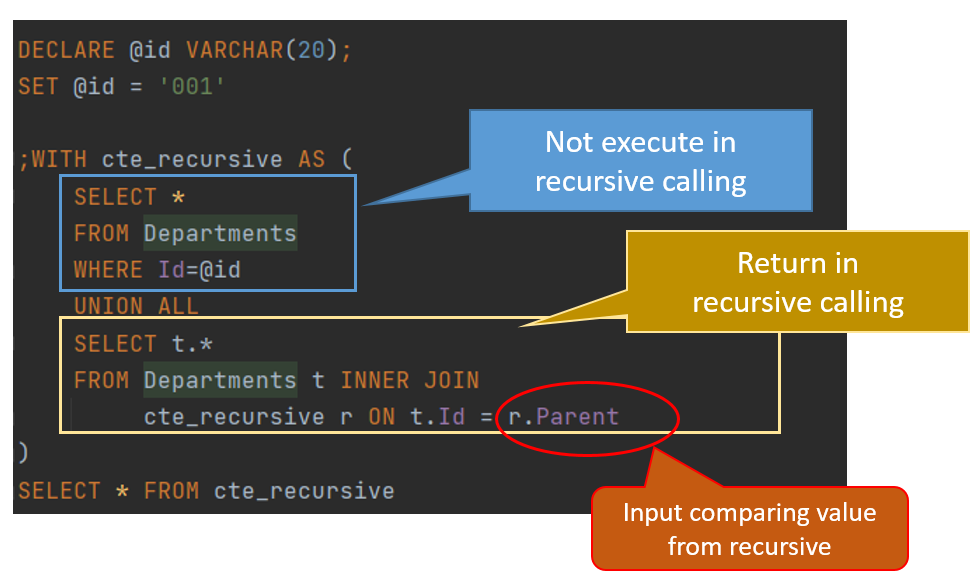

# Recursive CTE

Assume that we have a table which include hierarchy data like this,


| Id | Name | Parent |
|:------:|:----:|:---------:|
| 001 | Agile dev team | 003 |
| 002 | DevOps team | 003|
| 003 | Tiger department | 008 |
| 008 | IT | NULL |


and we would like to know the Agile dev team’s organizational hierarchy: 

`Agile dev team / Tiger department / IT`


Here is a sample for using [CTE(Common table expression)](https://technet.microsoft.com/en-us/library/ms190766(v=sql.105).aspx) to solve the problem.


### CTE

```sql
DECLARE @id VARCHAR(20);
SET @id = '001'

;WITH cte_recursive AS (
    SELECT *
    FROM Departments
    WHERE Id=@id
    UNION ALL
    SELECT t.*
    FROM Departments t INNER JOIN
         cte_recursive r ON t.Id = r.Parent
)
SELECT * FROM cte_recursive
```




The CTE results in:


### Function (Optional)


And we can create a function for advanced usage.

```sql
CREATE FUNCTION find_hirearchy_departmemts
(
    @id VARCHAR(20)
)
RETURNS TABLE
AS RETURN
    WITH cte_recursive AS (
        SELECT *
        FROM departments
        WHERE id=@id
        UNION ALL
        SELECT t.*
        FROM departments t INNER JOIN
        cte_recursive r ON t.id = r.parent
)
SELECT  * FROM cte_recursive
```
