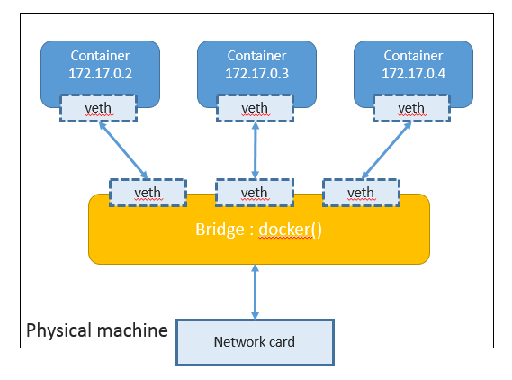

# Implemetation on kernel

## Base

- [Linux Container(LXC)](https://linuxcontainers.org/)
- [libcontainer]()


> [Difference between LXC and libcontainer](https://stackoverflow.com/a/34155329/7045253)


## Docker Daemon

`Docker Daemon` runs on the host and in charge of handling the client's requests, such as creating, running the contianers.

Docker host listens to `unix://var.run/docker.socket` and only allow to be used by the `root` user or users in docker's user group.


The following command can change the `Docker Daemon`'s default listening port to `1234`. 

```
$ docker daemon -H 0.0.0.0:1234 
```


On the client side, connet to the Docker host with port: 1234

```
$ docker -H 127.0.0.1:1234 version
```

Notice that in order to decrease the responsibility of `Docker Daemon` on both API handling and conatiner managing, the  newer version of Docker started using [`containerd`](https://github.com/containerd/containerd) to manage the containers. 
So that when the `Docker Daemon` is down, the containers will still be alive.   


## namespace

Docker uses many [Linux namespace](https://en.wikipedia.org/wiki/Linux_namespaces) technologies for isolation.
Here are some of the most important ones. 


### PID(Process Id)

The same process(task_struct) will has different PID in different namespaces.

PID namespace isolates the process ID number space, so that processes in different PID namespaces can have the same PID.
It provides functionality such as suspending or resuming processes in the container and the processes inside the container will remain the same PIDs when migrating to a new host.

To see the PID of a container:

```
$ docker inspect --format '{{.State.Pid}}' <container>
3207
```

Or use [`docker top`](https://docs.docker.com/engine/reference/commandline/top/)

```
$ docker top <container>
PID                 USER                COMMAND
3207                root                {run.sh} /bin/bash /run.sh
3264                root                /usr/sbin/sshd -D

$ docker top <container> -o pid -o ppid
PID                 PPID
3207                3179
3264                3207
```


### Network namespace(網路命名空間)

 Docker uses Linux network namespace and each container has its own network namespace, that means it has its own IP address, routing table, etc.

 

 

### IPC(Interprocesses Communication)

IPC is the communication protocals between processes. Some methodology implement IPC, such as [semaphore](https://en.wikipedia.org/wiki/Semaphore_(programming)),[message queue](https://en.wikipedia.org/wiki/Message_queue),[pipe](https://en.wikipedia.org/wiki/Pipeline_(Unix)),mutex(binary semaphore),[share memory](https://en.wikipedia.org/wiki/Shared_memory),[socket](https://en.wikipedia.org/wiki/Unix_domain_socket)


### Mount(Mnt namespace)


Mount namespaces control mount points. Upon creation the mounts from the current mount namespace are copied to the new namespace, but mount points created afterwards do not propagate between namespaces.

> The clone flag, `CLONE_NEWNS`, is used in `clone()` to create a new namespace.

However it's possible to propagate mount points between namespaces by using [share subtrees](https://lwn.net/Articles/689856/).


### UTS(UNIX Time-sharing System)

 Time-sharing is the sharing of a computing resource among many users by means of multiprogramming and multi-tasking at the same time.
 That is, the computer divides its execution time into multiple time periods, and distributes these time periods to the tasks specified by the users. Take certain amount of time for each task by turns until all tasks are completed.

### User(User ID)

User namespaces are a feature to provide both privilege isolation and user identification segregation across multiple sets of processes. With administrative assistance it is possible to build a container with seeming administrative rights without actually giving elevated privileges to user processes. Like the PID namespace, user namespaces are nested and each new user namespace is considered to be a child of the user namespace that created it. (From [WIKI](https://en.wikipedia.org/wiki/Linux_namespaces#User_ID_(user)))

Reference: [Isolate containers with a user namespace](https://docs.docker.com/engine/security/userns-remap/)


## CGroups (Control group)

Cgroups are used to 
1. Isolate processes
2. Allocate resources(CPU, RAM, disk), like processor time, number of processes per group, amount of memory per control group or combination of such resources for a process or set of processes
3. Checkpointing and restarting from checkpoint


### Create virtual network

When Docker create a container, it

1. Creates a [veth pair]()
2. The virtual inteface on local will connect to the default Docker() bridge or the one assigned
3. The other virtual interface will be put into the created container
4. Assign a IP to the container's eth0 and internal interface: docker0's IP from docker0 網卡




When running a container, we can modify the settings thru `--net`.

`--net=bridge`

Default value, create new virtual network card for a new container in Docker bridge: docker0

`--net=none`

Isolate the container and set the network later by user.

`--net=host`

Bind the new container with an exist network-setting container, they will share the IP address and Ports.
They can connect to each other by `lo`(Loopback)

`--net=user_defined_network`

Use `network` commands to create the network, usaually bind it with exist virtual network.


## References

* [Linux namespaces(WIKI)](https://en.wikipedia.org/wiki/Linux_namespaces)
* [DOCKER基础技术：LINUX NAMESPACE（上）](https://coolshell.cn/articles/17010.html)
* [DOCKER基础技术：LINUX NAMESPACE（下）](https://coolshell.cn/articles/17029.html)
* [Docker基础技术-Linux Namespace](https://www.jianshu.com/p/353eb8d8eb05)
