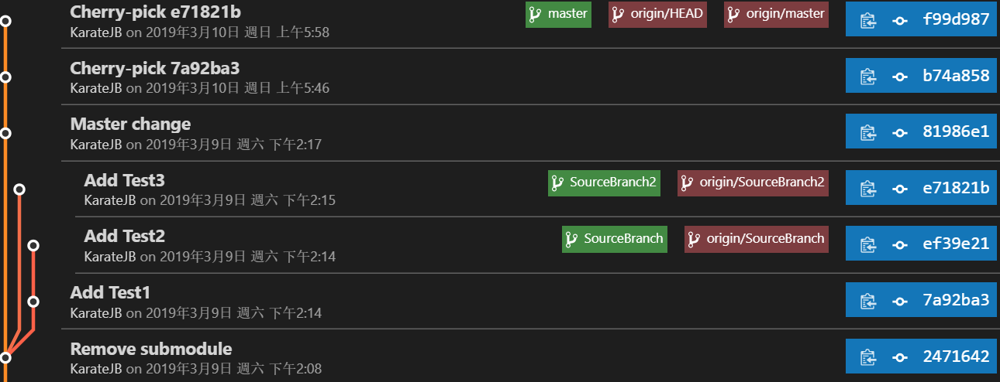

Cherry-pick is used for picking(copy) certain commit(s) from other branch 

Assume that we would like to pick some commits from `source_branch` to `target_branch`,

```
$ git checkout <target_branch>
$ git cherry-pick [--no-commit|-n] [--edit|-e] <sha1_code_1> [<sha1_code_2> ...]
```

## Options

| Option | Description |
|:------:|:------------|
| --no-commit (-n) | Without this option, `cherry-pick` automatically creates a sequence of commits.<br /> Use this option tp `cherry-pick` into the working tree and index without making any commit. |
| --edit (-e) |  Edit the commit message before committing. |
| --continue | Continue the operation in progress using the information in `.git/sequencer`.<br />Can be used to continue after resolving conflicts in a failed cherry-pick or revert. |
| --quit | Forget about the current operation in progress.<br />Can be used to clear the sequencer state after a failed cherry-pick or revert. |
| --abort | Cancel the operation and return to the pre-sequence state. |

[Reference: Git document](https://git-scm.com/docs/git-cherry-pick#Documentation/git-cherry-pick.txt)

# Example

## Cherry-pick one commit

In this example, we have 3 branches with the following commits,


Lets cherry-pick `7a92ba3` from `SourceBranch` by

```
$ git checkout master
$ git cherry-pick 7a92ba3 --no-commit
```

> If conflict(s) occurs during cherry-pick, an error message will be shown as `error: could not apply 7a92ba3... xxxxx`.<br />
> Solve the conflict and stage the files. 


Then add a whole new commit,

```
$ git commit -m "Cherry-pick 7a92ba3"
```

Result:


## Cherry-pick mutiple commits with conflicts

First I reset hard to `81986e1` for master branch, and cherry-pick `7a92ba3` from `SourceBranch`, `e71821b` from `SourceBranch2` to `master` by,

```
$ git cherry-pick 7a92ba3 e71821b --no-commit
```

First conflict on merging 7a92ba3:


### Abort

Before committing the merge, we can abort the Cherry-pick sequence by [--abort](https://git-scm.com/docs/git-cherry-pick#Documentation/git-cherry-pick.txt---abort),

```
$ git cherry-pick --abort
```

---


Here we will solve it and add a new commit,

```
$ git add .
$ git commit -m "Cherry-pick 7a92ba3"
```

Since we are in a Cherry-pick sequence, we have 2 options as following.

### Continue

Use [--continue option](https://git-scm.com/docs/git-cherry-pick#Documentation/git-cherry-pick.txt---continue) to continue the next Cherry-pick,

```
$ git cherry-pick --continue
```

### Quit

Or leave and forget the commits which have not been completed Cherry-pick by option, [--quit](https://git-scm.com/docs/git-cherry-pick#Documentation/git-cherry-pick.txt---quit).

```
$ git cherry-pick --quit
```

---

We will continue and try solving the second conflict on merging e71821b:


Then add another commit and push,

```
$ git add .
$ git commit -m "Cherry-pick e71821b"
$ git push
```

Final result:



