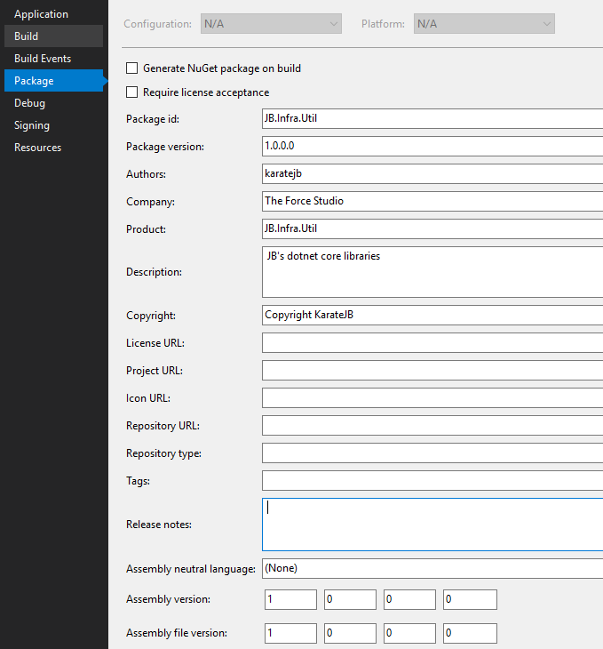
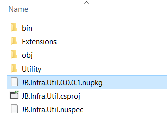

# Create Nuget Spec file
--

## Decide what will be packed 

Follow the suggestions from [Microsoft Document](https://docs.microsoft.com/en-us/nuget/create-packages/creating-a-package#deciding-which-assemblies-to-package):

1. Pack the libraries that have dependencies between them as a Nuget Package
2. For those independent libraries, pack them to separate Nuget Packages


## Creare .nuspec file

Go the the root path of target project,  

```
$ nuget spec
```

This command will create a `<>.nuspec` file into the project. The file contains the following metadata:

```xml
<?xml version="1.0"?>
<package >
  <metadata>
    <id>$id$</id>
    <version>$version$</version>
    <title>$title$</title>
    <authors>$author$</authors>
    <owners>$author$</owners>
    <licenseUrl>http://LICENSE_URL_HERE_OR_DELETE_THIS_LINE</licenseUrl>
    <projectUrl>http://PROJECT_URL_HERE_OR_DELETE_THIS_LINE</projectUrl>
    <iconUrl>http://ICON_URL_HERE_OR_DELETE_THIS_LINE</iconUrl>
    <requireLicenseAcceptance>false</requireLicenseAcceptance>
    <description>$description$</description>
    <releaseNotes>Summary of changes made in this release of the package.</releaseNotes>
    <copyright>Copyright 2019</copyright>
    <tags>Tag1 Tag2</tags>
  </metadata>
</package>
```


## Update .nuspec file

We can update the right information on the .nuspec file or

- Use [Replacement tokens](https://docs.microsoft.com/en-us/nuget/reference/nuspec#replacement-tokens)
- Pack cmd with `properties` argument


### Replacement tokens

The supported Replacement tokens are as follwoing,

| Token | Value source | Value |
|:------|:------------:|:------|
| $id$ | Project file | AssemblyName (title) from the project file |
| $version$ | AssemblyInfo	| AssemblyInformationalVersion if defined, otherwise AssemblyVersion |
| $authors$ | AssemblyInfo | AssemblyCompany |
| $title$ | AssemblyInfo | AssemblyTitle |
| $description$ | AssemblyInfo | AssemblyDescription |
| $copyright$ | AssemblyInfo | AssemblyCopyright |


In dotnet core project, we can write/find the above informations in .csporj file or in Visual Studio **[Project properties]**->**[Package]** as following,  




This is an example for using [Replacement tokens](https://docs.microsoft.com/en-us/nuget/reference/nuspec#replacement-tokens) in .nuspec file,

```xml
<?xml version="1.0"?>
<package >
  <metadata>
    <id>$id$</id>
    <version>$version$</version>
    <title>$title$</title>
    <authors>$authors$</authors>
    <owners>$authors$</owners>
    <!--<license type="file">LICENSE</license>-->
    <license type="expression">MIT</license>
    <projectUrl>https://github.com/KarateJB/JB.Infra</projectUrl>
    <requireLicenseAcceptance>false</requireLicenseAcceptance>
    <description>$description$</description>
    <releaseNotes>
      v1.0.0.0
      Awesome package(?)
    </releaseNotes>
    <copyright>$copyright$</copyright>
    <tags>dotnetcore util ef</tags>
  </metadata>
</package>
```

> **license** tag allows the pattern:`<license type="expression | file" />` <br />
> ex. <br />
> `<license type="expression">Apache-2.0</license>` <br />
> `<license type="file">LICENSE.txt</license>` (Supported format: md, txt) <br /><br />
> Reference: [Packaging License within the nupkg](https://github.com/NuGet/Home/wiki/Packaging-License-within-the-nupkg)


### Pack cmd with properties argument


```
$ nuget pack -properties <name>=<value>;<name>=<value>
```

For example,

```
$ nuget pack -properties tags="dotnetcore util ef";description="My nuget package"
```


## Pack the library/libraries

```
$ nuget pack <nuspec_path | project_path> [options] [-Properties ...] 
```


For more options. see [pack command (NuGet CLI)](https://docs.microsoft.com/en-us/nuget/tools/cli-ref-pack#options)


For example,

```
$ nuget pack ../xxx/xxx.csproj
```

> Notice that to pack another project which has no `.nuspec` file will have some bugs,  like the `Author` property will be set to the value of `Company` from Project file. <br />
> Thus it's recommanded to pack the project which has local `.nuspec` file.


Or the most useful case is set the configuration and version:

```
$ nuget pack xxx.csproj -Properties Configuration=Release -Version 0.0.0.1
```

### Demo

```
$ dotnet build --configuration release
$ nuget pack JB.Infra.Util.csproj -Properties Configuration=Release -Version 0.0.0.1
```

Result:




