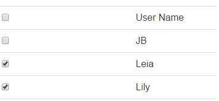
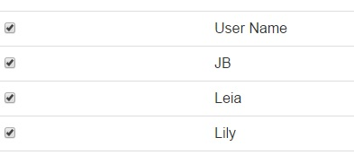
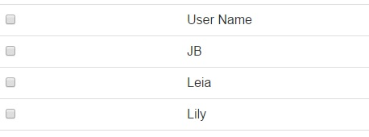

## Introduction 

1. 實作一個有Checkbox的清單。
2. 實作全選/取消全選功能。
3. 預設的Checkbox勾選狀態可依據Model的欄位值而決定。


## Implement

### 預期結果

起始畫面，每個資料的Checkbox會有預設值。



當勾選上方的Checkbox時，會全選。



當取消勾選上方的Checkbox時，會取消全選。




### 全選/取消全選

實作此功能時，最快（官方）的方式如下。

* HTML

只要在每個資料的Checkbox綁定 `ngChecked` 為全選/取消全選的最上層Checkbox的`ngModel` ，即可達到此需求。

```
<table data-toggle="table" class="table">
   <tr class="tr-class-1">
                <td><input type="checkbox" ng-model="selectAllorNone"/></td>
                <td>User Name</td>
            </tr>
            <tr class="tr-class-2" ng-repeat="item in userList">
                <td><input type="checkbox"  ng-checked="selectAllorNone" /></td>
                <td>{{item.UserName}}</td>
            </tr>
</table>
```

* JS

```
var app = angular.module('app', [])
.controller('UserCtrl', function ($scope,$http) {
   
    $scope.name = "";
    $scope.userList = [];

    var getUrl = "http://localhost:7531/api/Account/GetAllUsers";
    $http.get(getUrl).success(function (users) {
     
        $scope.userList = users;

    }).error(function (data, status, headers, config) {
        console.log(data, status, headers, config);
    });

});
```


### 預設的Checkbox勾選狀態可依據Model的欄位值而決定

> **ng-checked 的限制**

> But … 上面的 ng-checked會有所限制。請詳見此篇文章：
> [AngularJS: ng-model not binding to ng-checked for checkboxes](http://stackoverflow.com/questions/16601018/angularjs-ng-model-not-binding-to-ng-checked-for-checkboxes)
> 提到：「ngModel and ngChecked are not meant to be used together」

我們先以直覺的方式開發第三個需求來了解這個限制~

* HTML

```
<table data-toggle="table" class="table">
            <tr class="tr-class-1">
                <td><input type="checkbox" ng-model="selectAllorNone" /></td>
               <td>User Name</td>
               <td>Checked</td>
            </tr>
            <tr class="tr-class-2" ng-repeat="item in userList">
                <td><input type="checkbox"  ng-checked="selectAllorNone"
ng-model="item.Checked" /></td>
                <td>{{item.UserName}}</td>
                <td>{{item.Checked}}</td>
            </tr>
        </table>
```

* Controller

在這邊對回傳的所有物件，依據條件加上預設的Checkbox選取註記：`Checked`

```
var app = angular.module('app', [])
.controller('UserCtrl', function ($scope,$http) {
   
    $scope.name = "";
    $scope.userList = [];

    var getUrl = "http://localhost:7531/api/Account/GetAllUsers";
    $http.get(getUrl).success(function (users) {
     
        $scope.userList = users;

        angular.forEach($scope.userList, function (item) {
            if (item.UserName != "JB")
                item.Checked = true;
            else
                item.Checked = false;
        });

    }).error(function (data, status, headers, config) {
        console.log(data, status, headers, config);
    });
});
```

接下來我們先拿掉View上面的`ngChecked`，  執行結果如下，這時候是正確的，每個資料的核取已參考到`Checked`的屬性。


重新加上`ng-checked`，以啟用全選/取消全選功能，可是這時候發現，預設的核取狀態已經失效了~
畫面上另外顯示的Checked欄位證明了上面所說的**「ngModel and ngChecked are not meant to be used together」**。


### 修正

我們取消`ngChecked`的做法，改成在全選/取消全選的Checkbox，加上`ngClick`去動態改變所有資料的Checkbox核取狀態。

* HTML

```
<table data-toggle="table" class="table">
            <tr class="tr-class-1">
                <td>
                    <input type="checkbox"
ng-model="selectAllorNone"
ng-click="changeSelectAllorNone()"
ng-true-value="'Yes'" ng-false-value="'No'" />
                    @*<input type="checkbox" ng-model="selectAllorNone"  />*@
                </td>
                <td>User Name</td>
            </tr>
            <tr class="tr-class-2" ng-repeat="item in userList">
                <td>
                    <input type="checkbox" ng-model="item.Checked" />
                    @*<input type="checkbox"  ng-checked="selectAllorNone" ng-model="item.Checked" />*@
                </td>

                <td>{{item.UserName}}</td>
            </tr>
            <tr class="tr-class-5">
                <td colspan="2"><input type="button" value="刪除" ng-click="unregisterUsers()" /></td>
            </tr>
        </table>
```

* JS

```
var app = angular.module('app', [])
.controller('UserCtrl', function ($scope, $http) {

    $scope.name = "";
    $scope.userList = [];

    var getUrl = "http://localhost:7531/api/Account/GetAllUsers";
    $http.get(getUrl).success(function (users) {

        $scope.userList = users;

        angular.forEach($scope.userList, function (item) {
            if (item.UserName != "JB")
                item.Checked = true;
            else
                item.Checked = false;
        });

    }).error(function (data, status, headers, config) {
        console.log(data, status, headers, config);
    });

    $scope.changeSelectAllorNone = function () {
        angular.forEach(this.userList, function (item) {
            item.Checked = $scope.selectAllorNone;        
});
    }
});
```


### 小技巧：ng-true-value & ng-false-value

可利用`ng-true-value` & `ng-false-value`指定在預設為boolean值的`ngModel`所對應的值。
例如，在HTML的部分可改成：（只列出修改部分）

```
<input type="checkbox" ng-model="selectAllorNone" ng-click="changeSelectAllorNone()" ng-true-value="'Yes'" ng-false-value="'No'" />
```

這時候在Controller的 `$scope.selectAllorNone` 其值就會是 “Yes” 或者為 “No”。


## Reference

1. [AngularJS Documentation for input[checkbox]](https://docs.angularjs.org/api/ng/input/input%5Bcheckbox%5D)
2. [AngularJS: ng-model not binding to ng-checked for checkboxes](http://stackoverflow.com/questions/16601018/angularjs-ng-model-not-binding-to-ng-checked-for-checkboxes)


