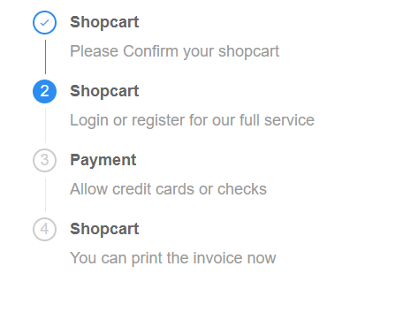

# iView - Steps

> 一套基於 Vue.js 的高質量UI 組件庫，此篇介紹步驟條(Steps)


## Github

[iview/iview](https://github.com/iview/iview)


## 範例

先定義幾個步驟：

```javascript
const STEPS = {
    shopcart: {
        title: "Shopcart",
        description: "Please Confirm your shopcart"    
    },
    login: {
        title: "Shopcart",
        description: "Login or register for our full service"    
    },
    payment: {
        title: "Payment",
        description: "Allow credit cards or checks"    
    },
    invoice: {
        title: "Shopcart",
        description: "You can print the invoice now"    
    }
}
```

```html
<steps :current="1">
    <step :title="steps.shopcart.title" :content="steps.shopcart.description"></step>
    <step :title="steps.login.title" :content="steps.login.description"></step>
    <step :title="steps.payment.title" :content="steps.payment.description"></step>
    <step :title="steps.invoice.title" :content="steps.invoice.description"></step>
</steps>
```

其中當改變`current`的值時(由1開始)，將會依照DOM的順序呈現目前所在步驟。
結果如下：


### 設定顯示方式

另可指定`size='small`來縮小步驟條，及 `direction='vertical'`(預設為`horizontal`)指定以垂直方式顯示。

```html
<steps :current="currentStep">
    <step :title="steps.shopcart.title" :content="steps.shopcart.description" ></step>
    <step :title="steps.login.title" :content="steps.login.description" ></step>
    <step :title="steps.payment.title" :content="steps.payment.description"></step>
    <step :title="steps.invoice.title" :content="steps.invoice.description"></step>
</steps>
```




### 指定顯示狀態

我們可透過設定`<step>`的Prop: `status`為

- `wait`
- `process`
- `finish`
- `error`

來顯示各種不同的狀態：

```html
<steps :current="currentStep">
    <step :title="steps.shopcart.title" :content="steps.shopcart.description" status='wait'></step>
    <step :title="steps.login.title" :content="steps.login.description" status='process'></step>
    <step :title="steps.payment.title" :content="steps.payment.description" status='finish'></step>
    <step :title="steps.invoice.title" :content="steps.invoice.description" status='error'></step>
</steps>
```

若要手動設定不同的icon可利用`<step>`的另一個Prop: `icon`。


### Demo

底下範例利用Steps來切換顯示的Component內容；

- Component

```javascript
Vue.component('myStep', {
    props: [
        'data'
    ],
    data: function () {
        return {
        };
    },
    template: '<div><h2>{{ data.title }}</h2><br />{{ data.description }}<div>'
})
```

- Main HTML

```html
<steps :current="currentStep">
    <step :title="steps.shopcart.title" :content="steps.shopcart.description"></step>
    <step :title="steps.login.title" :content="steps.login.description"></step>
    <step :title="steps.payment.title" :content="steps.payment.description"></step>
    <step :title="steps.invoice.title" :content="steps.invoice.description"></step>
</steps>

<my-step v-if="currentStep==0" :data="steps.shopcart"></my-step>
<my-step v-if="currentStep==1" :data="steps.login"></my-step>
<my-step v-if="currentStep==2" :data="steps.payment"></my-step>
<my-step v-if="currentStep==3" :data="steps.invoice"></my-step>
```

- JS

```javascript
const STEPS = {
    shopcart: {
        title: "Shopcart",
        description: "Please Confirm your shopcart"    
    },
    login: {
        title: "Login",
        description: "Login or register for our full service"    
    },
    payment: {
        title: "Payment",
        description: "Allow credit cards or checks"    
    },
    invoice: {
        title: "Shopcart",
        description: "You can print the invoice now"    
    }
}

var app = new Vue({
    el: "#app",
    data: {
        currentStep: 0,
        steps: null
    },
    methods: {
        updateCurrentStep(num){
            this.currentStep +=num;
        }
    },
    created() {
        this.steps = STEPS;
    }
})
```

[Sample Code](https://github.com/KarateJB/eBooks/tree/master/Vue.js/14.%20iView-Steps/sample%20code)


> 請參考其API:[Steps Props](https://www.iviewui.com/components/steps#Steps_props)及[Step Props](https://www.iviewui.com/components/steps#Step_props)。


